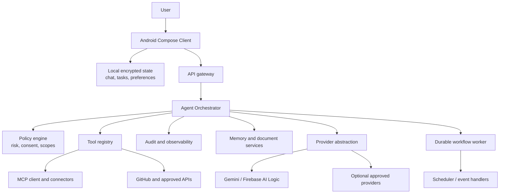

# AI Assistant — System Architecture

## Architecture Position

The production system should use an Android-native client for presentation and device permissions, a server-side orchestration boundary for secret-bearing and durable work, and a pluggable provider layer. The prototype implements only a small subset: a mobile interface, local persisted state, and a server-side text-response endpoint. The target architecture below is intentionally broader and must be implemented incrementally with security gates.



## Core Layers

| Layer | Responsibility | Contract |
|---|---|---|
| Android client | Compose UI, permission prompts, local encrypted cache, display of progress and approvals | It sends explicit user intents and never owns long-running secrets or privileged tool logic |
| API gateway | Authentication, rate controls, schema validation, request correlation | It rejects malformed or unauthorized requests before orchestration |
| Agent orchestrator | Intent classification, plan creation, tool selection, state machine, result synthesis | It records `QUEUED`, `PLANNING`, `RUNNING`, `WAITING`, `RETRYING`, `BLOCKED`, `COMPLETED`, `FAILED`, or `CANCELLED` state transitions |
| Policy engine | Risk classification, consent, approval, scope, and consequence checks | It can deny or block a tool call even when a model requests it |
| Provider abstraction | Text, vision, audio, embeddings, image generation, and tool-calling interfaces | Each provider failure returns a typed degraded outcome rather than crashing the client |
| Tool registry | Tool metadata, input/output schema, permissions, timeout, retry policy, audit hooks | Only registered and policy-approved tools are executable |
| Durable worker | Scheduled/event work, retries, idempotency, cancellation, and notifications | It is server-side; a handset is not treated as a 24/7 execution host |

## Model and Tool Execution Boundary

The model may propose a function and arguments, but it does not execute the function. The application must validate the proposal, execute only authorized actions, and return a result for the final response.[1] Every executable tool therefore requires a schema, risk level, permission declaration, timeout, retry policy, and audit record. An LLM output is input to the policy layer, not proof that an action should occur.

## Provider Strategy

The first production provider path should use Firebase AI Logic with the Gemini Developer API or another selected Gemini API provider. Firebase AI Logic offers Android client SDKs, API-key protection via a proxy boundary, App Check support, per-user rate controls, and a path to multimodal features.[2] All provider-specific model identifiers, quotas, and prices must be retrieved at runtime or during release validation rather than assumed from documentation snapshots.

```kotlin
interface TextModelProvider {
  suspend fun respond(request: ChatRequest): ProviderResult<ChatResponse>
}

interface ToolCallingProvider {
  suspend fun proposeTools(request: ToolPlanningRequest): ProviderResult<ToolProposal>
}
```

## Data Ownership

The Android application should retain a local database as the client-side source of truth for conversations, drafts, task summaries, and user preferences. The server should hold only the durable records necessary for authorized workflows, account synchronization, connectors, audit logs, and documents. Android recommends a persistent single source of truth and unidirectional data flow, especially because mobile processes may be terminated by the operating system.[3]

## References

[1] [Google AI for Developers — Function calling with the Gemini API](https://ai.google.dev/gemini-api/docs/function-calling)

[2] [Firebase — Gemini API using Firebase AI Logic](https://firebase.google.com/docs/ai-logic)

[3] [Android Developers — Guide to app architecture](https://developer.android.com/topic/architecture)
